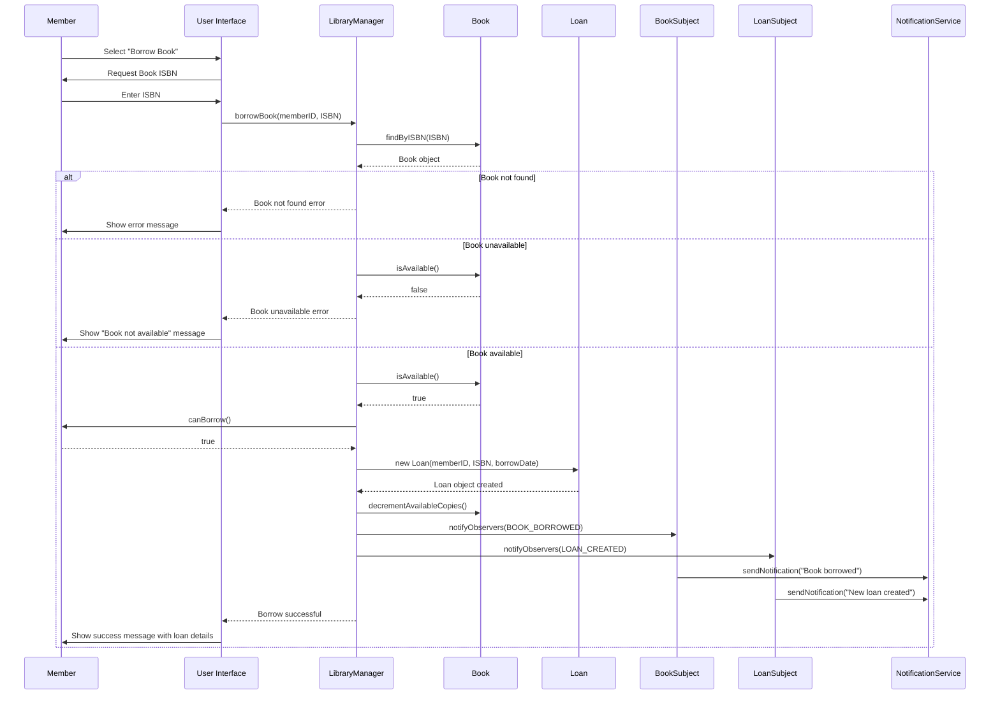

```mermaid
sequenceDiagram
    participant M as Member
    participant UI as User Interface
    participant LM as LibraryManager
    participant B as Book
    participant L as Loan
    participant BS as BookSubject
    participant LS as LoanSubject
    participant NO as NotificationService

    M->>UI: Select "Borrow Book"
    UI->>M: Request Book ISBN
    M->>UI: Enter ISBN
    UI->>LM: borrowBook(memberID, ISBN)
    
    LM->>B: findByISBN(ISBN)
    B-->>LM: Book object
    
    alt Book not found
        LM-->>UI: Book not found error
        UI->>M: Show error message
    else Book unavailable
        LM->>B: isAvailable()
        B-->>LM: false
        LM-->>UI: Book unavailable error
        UI->>M: Show "Book not available" message
    else Book available
        LM->>B: isAvailable()
        B-->>LM: true
        LM->>M: canBorrow()
        M-->>LM: true
        
        LM->>L: new Loan(memberID, ISBN, borrowDate)
        L-->>LM: Loan object created
        LM->>B: decrementAvailableCopies()
        
        LM->>BS: notifyObservers(BOOK_BORROWED)
        LM->>LS: notifyObservers(LOAN_CREATED)
        BS->>NO: sendNotification("Book borrowed")
        LS->>NO: sendNotification("New loan created")
        
        LM-->>UI: Borrow successful
        UI->>M: Show success message with loan details
    end
```