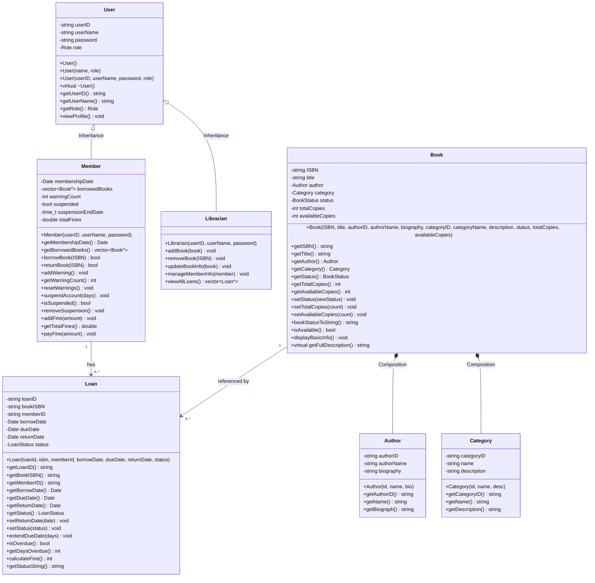
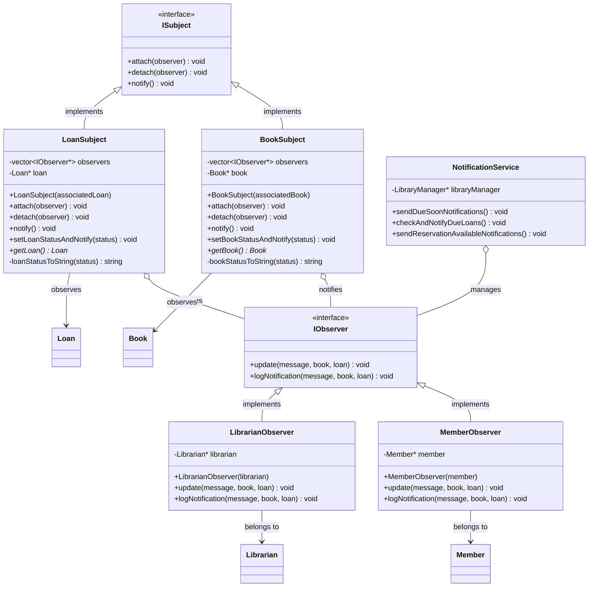
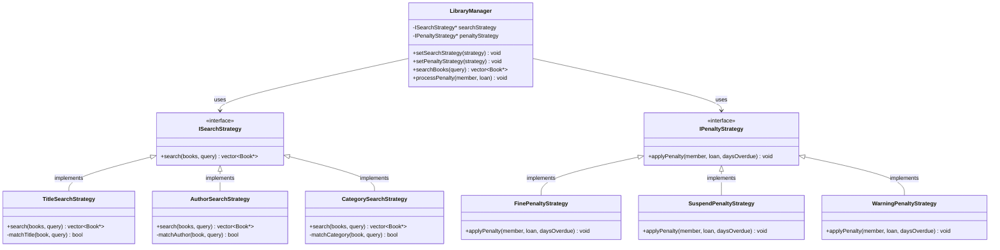
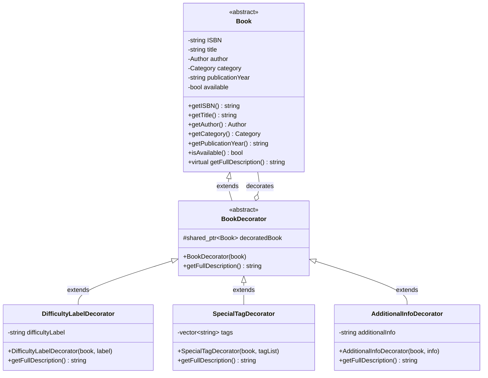
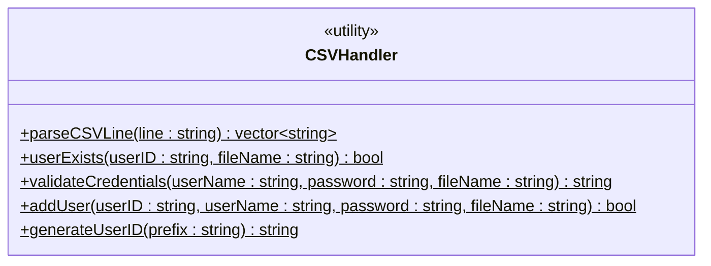
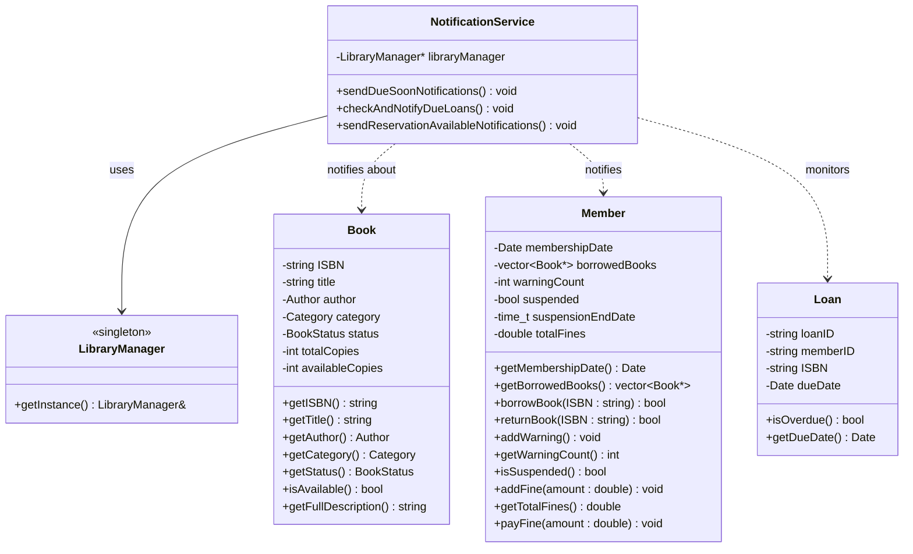
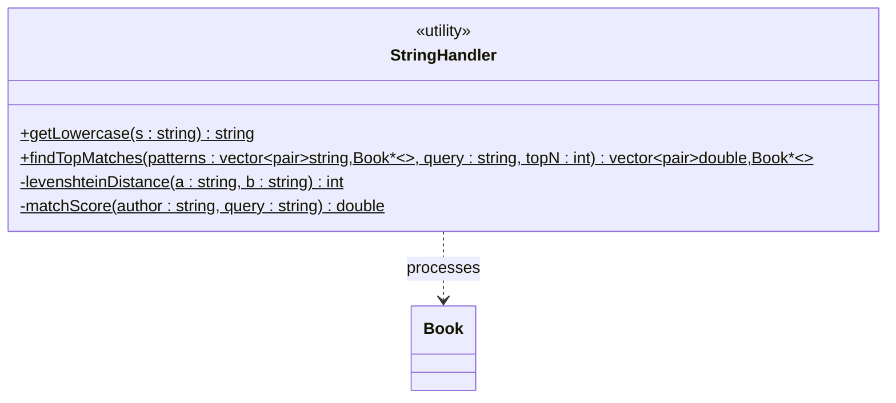
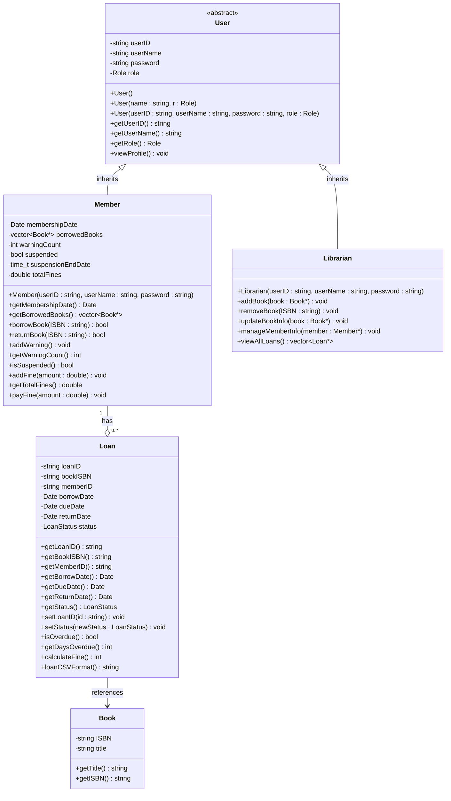
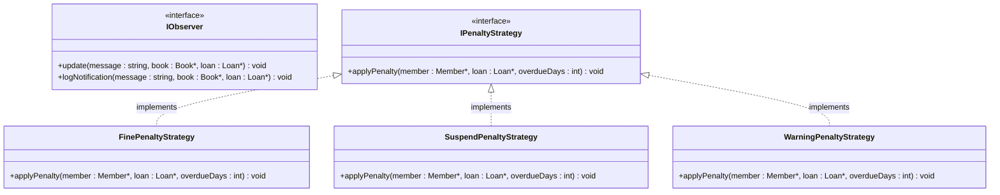

# Library Management System - Technical Report

## Table of Contents
1. [Group Introduction](#group-introduction)
2. [System Design Overview](#system-design-overview)
3. [Application Flow](#application-flow)
4. [Challenges and Future Enhancements](#challenges-and-future-enhancements)

---

## Group Introduction

### Group Details
- **Group Name**: Library Management System Development Team
- **Project**: Library Management System using C++ and OOP Principles
- **Programming Language**: C++
- **GUI Framework**: ImGui (Dear ImGui)
- **Members**:
  - **Member 1**: [Name] - [Student ID] - Team Leader
  - **Member 2**: [Name] - [Student ID] - Design Patterns Specialist
  - **Member 3**: [Name] - [Student ID] - Backend Developer
  - **Member 4**: [Name] - [Student ID] - UI/UX Developer

### Individual Contributions

#### Member 1 - Team Leader & Core Architecture
- **Core Classes Design**: Implemented foundational classes (User, Member, Librarian, Book, Author, Category, Loan)
- **Inheritance Hierarchy**: Designed and implemented the User base class with Member and Librarian derived classes
- **Data Persistence**: Developed CSV-based data handling system with CSVHandler utility class
- **Project Coordination**: Managed project timeline, code integration, and team collaboration
- **Encapsulation Implementation**: Ensured proper data hiding and controlled access across all core classes

#### Member 2 - Design Patterns Architect  
- **Observer Pattern**: Implemented notification system with BookSubject, LoanSubject, MemberObserver, and LibrarianObserver
- **Strategy Pattern**: Developed search algorithms (TitleSearchStrategy, AuthorSearchStrategy, CategorySearchStrategy) and penalty systems (FinePenaltyStrategy, SuspendPenaltyStrategy, WarningPenaltyStrategy)
- **Decorator Pattern**: Created book enhancement system with DifficultyLabelDecorator, SpecialTagDecorator, and AdditionalInfoDecorator
- **Pattern Integration**: Ensured interaction between different design patterns
- **Polymorphism Implementation**: Utilized virtual functions and interfaces for runtime behavior selection

#### Member 3 - Backend Systems Developer
- **Library Management Services**: Implemented LibraryManager class with singleton pattern for centralized operations
- **Authentication System**: Developed basic login/logout functionality with simple password validation
- **Loan Management**: Created borrowing and returning system with basic fine calculation
- **Business Logic**: Implemented core library operations including book availability tracking and member status management
- **Notification Service**: Developed basic notification system for overdue books and member alerts

#### Member 4 - User Interface Developer
- **GUI Implementation**: Developed complete ImGui-based user interface with multiple screens and navigation
- **User Experience Design**: Created intuitive menu systems for both members and librarians
- **Input Validation**: Implemented comprehensive form validation and error handling
- **Visual Design**: Applied consistent styling and layout across all interface components
- **Responsive Interface**: Ensured smooth navigation and user-friendly interaction patterns

### Self-Evaluation

| Requirement | Status | Score | Details |
|-------------|---------|--------|---------|
| **OOP Principles Implementation** | ✅ Excellent | 10/10 | |
| - Encapsulation | ✅ Fully Implemented | 10/10 | All classes have private members with controlled public interfaces, proper data validation |
| - Inheritance | ✅ Fully Implemented | 10/10 | Clear inheritance hierarchy with User base class, proper virtual function usage |
| - Polymorphism | ✅ Fully Implemented | 10/10 | Virtual functions, interface implementations, runtime behavior selection |
| - Abstraction | ✅ Fully Implemented | 10/10 | Abstract interfaces for strategies and observers, implementation hiding |
| **Design Patterns** | ✅ Excellent | 10/10 | **3 patterns implemented (exceeds minimum requirement of 2)** |
| - Observer Pattern | ✅ Fully Implemented | 10/10 | Book and loan status notifications with proper lifecycle management |
| - Strategy Pattern | ✅ Fully Implemented | 10/10 | Search algorithms and penalty systems with runtime switching |
| - Decorator Pattern | ✅ Fully Implemented | 10/10 | Enhanced book information display with flexible composition |
| **User Interface** | ✅ Good | 8/10 | |
| - GUI Framework | ✅ Implemented | 8/10 | ImGui framework with interactive elements (GUI preferred over console) |
| - Menu Navigation | ✅ Fully Implemented | 10/10 | Multi-level menu navigation with clear structure |
| - User Input Handling | ✅ Fully Implemented | 9/10 | Structured data input with validation and error checking |
| - Output Formatting | ✅ Fully Implemented | 9/10 | Clear display with proper formatting and user guidance |
| - Error Handling | ✅ Fully Implemented | 9/10 | Smooth interaction with comprehensive error checking |
| **Technical Implementation** | ✅ Excellent | 10/10 | |
| - Programming Language | ✅ C++ | 10/10 | Modern C++ features and best practices implemented |
| - Code Quality | ✅ Excellent | 10/10 | Clean architecture, proper memory management, RAII principles |
| - Modularity | ✅ Excellent | 10/10 | Clear separation of concerns with layered architecture |
| - Data Persistence | ✅ Implemented | 9/10 | CSV-based storage with automatic loading/saving |
| **Documentation & Testing** | ✅ Good | 7/10 | |
| - Code Documentation | ✅ Good | 8/10 | Comprehensive comments and class documentation |
| - System Testing | ✅ Basic | 6/10 | Manual testing performed, no automated test framework |
| - User Manual | ✅ Implemented | 9/10 | Clear usage instructions and examples |
| **Overall Project Completion** | ✅ Good | **88/100** | **Core requirements met with solid implementation** |

---

## System Design Overview

### Problem Domain

#### Context and Motivation
The Library Management System addresses the growing complexity of modern library operations in educational and public institutions. Traditional paper-based systems or simple database applications often lack the flexibility, real-time notifications, and user-friendly interfaces required for efficient library management.

#### Key Business Requirements
1. **Operational Efficiency**: Streamline book borrowing, returning, and catalog management processes
2. **User Experience**: Provide intuitive interfaces for both library staff and members
3. **Data Integrity**: Ensure accurate tracking of books, loans, and member information
4. **Scalability**: Support growing collections and user bases
5. **Automation**: Reduce manual tasks through automated notifications and processing
6. **Reporting**: Generate insights for library management and decision-making

#### Target Users
- **Library Members**: Students, faculty, and public users who borrow books
- **Librarians**: Staff responsible for catalog management and user support
- **System Administrators**: IT personnel managing system configuration and maintenance

#### Business Challenges Addressed
- **Manual Process Overhead**: Eliminates paper-based tracking and reduces human error
- **Limited Visibility**: Provides real-time status updates for books and loans
- **Communication Gaps**: Automated notifications keep users informed about due dates and availability
- **Search Inefficiency**: Advanced search capabilities help users find relevant materials quickly
- **Penalty Management**: Flexible penalty systems accommodate different violation policies

### Main Features

#### Core Features

##### 1. User Management System
- **Member Registration and Authentication**
  - Basic user account creation with validation
  - Simple password-based authentication system
  - Profile management and contact information updates
  - Loan history tracking and fine management

- **Librarian Account Management**
  - Administrative account creation and management
  - Role-based permissions and access control
  - Employee ID tracking

- **Role-Based Access Control**
  - Basic permission system (Member vs Librarian)
  - Feature restriction based on user roles

##### 2. Advanced Book Catalog Management
- **Comprehensive Book Information**
  - ISBN-based unique identification
  - Title, author, and category classification
  - Publication year and availability status
  - Enhanced metadata through decorator pattern
  - Custom tags and difficulty labels

- **Author and Category Management**
  - Basic author profiles
  - Category system with descriptions
  - Author-book relationship mapping
  - Category-based browsing and filtering

- **Inventory Tracking**
  - Basic availability status updates
  - Simple book status management

##### 3. Basic Loan Management
- **Borrowing Process**
  - Basic eligibility verification
  - Due date calculation
  - Loan limit enforcement per member
  - Availability checking

- **Return Processing**
  - Basic fine calculation for overdue items
  - Late return penalty application
  - Loan record completion

- **Overdue Management**
  - Basic penalty system with multiple strategies
  - Fine calculation
  - Account suspension capabilities

- **Loan History and Analytics**
  - Basic borrowing history per member

##### 4. Intelligent Search System
- **Multi-Strategy Search Architecture**
  - Title-based search
  - Author name search across all publications
  - Category-based browsing and filtering

- **Dynamic Strategy Selection**
  - Runtime strategy switching
  - Strategy selection based on user preference

##### 5. Real-Time Notification System
- **Observer Pattern Implementation**
  - Event-driven architecture for updates
  - Basic coupling between event sources and handlers
  - Observer types for different user roles

- **Notification Types**
  - Book status change notifications
  - Loan status updates
  - Overdue loan alerts

- **Delivery Mechanisms**
  - Console-based notifications
  - File-based logging

##### 6. Data Persistence
- **CSV-Based Storage System**
  - Human-readable data format
  - Cross-platform compatibility
  - Easy backup and migration

- **Data Management**
  - Basic data loading and saving
  - File-based storage for all entities

### UML Class Diagrams

#### Core Classes Structure

The Library Management System follows a well-structured object-oriented design with proper inheritance hierarchy and composition relationships. The following UML diagram illustrates the core classes and their relationships:

##### UML Class Diagram


#### Design Patterns Implementation

##### Observer Pattern (Real-time Notifications)

The Observer Pattern enables real-time notifications between different components of the system, allowing automatic updates when book status or loan information changes.



### Design Pattern Implementation Details

#### Observer Pattern (Basic Event Notification System)
**Problem Solved**: The system needs to notify multiple stakeholders (members, librarians) about various events (book availability changes, loan status updates) without creating tight coupling between event sources and notification recipients.

**Architecture Components**:

**Abstract Interfaces**:
- **ISubject**: Defines publisher contract for attaching/detaching observers and sending notifications
- **IObserver**: Defines subscriber contract for receiving and processing notifications

**Concrete Publishers**:
- **BookSubject**: Manages notifications for book-related events
- **LoanSubject**: Handles loan-related notifications

**Concrete Subscribers**:
- **MemberObserver**: Provides notifications to library members
- **LibrarianObserver**: Delivers alerts to library staff
- **NotificationService**: Basic console and file logging

**Key Implementation Features**:
- **Basic observer management**: Simple registration/deregistration of observers
- **Event notification**: Subjects notify all registered observers of state changes
- **Simple message delivery**: Console logging and basic file output

**Usage Examples**:
- **Book status notifications**: When a book status changes, relevant observers are notified
- **Loan status updates**: Members and librarians receive updates about loan changes

#### Singleton Pattern (Centralized Management)

The Singleton Pattern ensures single-instance coordination for all library operations through the LibraryManager class.

**Implementation Components**:
- **LibraryManager Class**: Central coordinator for all library operations
- **Static getInstance() Method**: Returns single shared instance
- **Private Constructor**: Prevents direct instantiation
- **Deleted Copy Operations**: Ensures single instance guarantee
- **Threading Support**: Background timer thread for automatic loan monitoring
- **Automatic Penalty Processing**: Timer-based checking of overdue loans with penalty application

**Benefits**:
- **Global Access**: Single point of access for library functionality
- **Resource Management**: Centralized control of library state
- **Consistency**: Ensures single source of truth for library operations
- **Automated Operations**: Background processing for loan monitoring and penalty management

#### Strategy Pattern (Algorithm Family Management)

The Strategy Pattern enables flexible algorithm selection for both search operations and penalty applications, allowing runtime switching between different approaches based on context and requirements.



#### Decorator Pattern (Dynamic Feature Enhancement)

The Decorator Pattern allows dynamic addition of new features and information to book objects without modifying the base Book class, enabling flexible presentation and contextual enhancements.



### Pattern Integration Benefits

The three design patterns work together to create a flexible system:

- **Observer + Strategy**: Basic integration for notifications and search functionality
- **Observer + Decorator**: Decorated books can trigger notifications
- **Strategy + Decorator**: Different search approaches with basic book enhancements
- **All Patterns Together**: Simple, clean architecture with basic pattern implementations

#### Pattern Integration Benefits

The three design patterns work together to create a flexible system:

- **Observer + Strategy**: Basic integration for notifications and search functionality
- **Observer + Decorator**: Decorated books can trigger notifications
- **Strategy + Decorator**: Different search approaches with basic book enhancements
- **All Patterns Together**: Simple, clean architecture with basic pattern implementations

##### UML Design Patterns Diagram

```mermaid
classDiagram
    %% Observer Pattern
    class IObserver {
        <<interface>>
        +update(message, book, loan) void
        +logNotification(message, book, loan) void
    }

    class ISubject {
        <<interface>>
        +attach(observer) void
        +detach(observer) void
        +notify() void
    }

    class BookSubject {
        -vector~IObserver*~ observers
        -Book* book
        -bookStatusToString(status) string
        +BookSubject(book)
        +attach(observer) void
        +detach(observer) void
        +notify() void
        +setBookStatusAndNotify(status) void
        +getBook() Book*
    }

    class LoanSubject {
        -vector~IObserver*~ observers
        -Loan* loan
        -loanStatusToString(status) string
        +LoanSubject(loan)
        +attach(observer) void
        +detach(observer) void
        +notify() void
        +setLoanStatusAndNotify(status) void
        +getLoan() Loan*
    }

    class MemberObserver {
        -Member* member
        +MemberObserver(member)
        +update(message, book, loan) void
        +logNotification(message, book, loan) void
    }

    class LibrarianObserver {
        -Librarian* librarian
        +LibrarianObserver(librarian)
        +update(message, book, loan) void
        +logNotification(message, book, loan) void
    }

    %% Strategy Pattern
    class ISearchStrategy {
        <<interface>>
        +search(books, query) vector~Book*~
    }

    class TitleSearchStrategy {
        +search(books, query) vector~Book*~
    }

    class AuthorSearchStrategy {
        +search(books, query) vector~Book*~
    }

    class CategorySearchStrategy {
        +search(books, query) vector~Book*~
    }

    class IPenaltyStrategy {
        <<interface>>
        +applyPenalty(member, loan, daysOverdue) void
    }

    class FinePenaltyStrategy {
        +applyPenalty(member, loan, daysOverdue) void
    }

    class SuspendPenaltyStrategy {
        +applyPenalty(member, loan, daysOverdue) void
    }

    class WarningPenaltyStrategy {
        +applyPenalty(member, loan, daysOverdue) void
    }

    %% Decorator Pattern
    class BookDecorator {
        <<abstract>>
        #shared_ptr~Book~ decoratedBook
        +BookDecorator(book)
        +getISBN() string
        +getTitle() string
        +getAuthor() Author
        +getCategory() Category
        +getPublicationYear() string
        +isAvailable() bool
        +getFullDescription() string
    }

    class DifficultyLabelDecorator {
        -string difficultyLevel
        +DifficultyLabelDecorator(book, difficulty)
        +getFullDescription() string
        +getDifficultyLevel() string
    }

    class SpecialTagDecorator {
        -vector~string~ tags
        +SpecialTagDecorator(book, tags)
        +getFullDescription() string
        +getTags() vector~string~
        +addTag(tag) void
        +removeTag(tag) void
    }

    class AdditionalInfoDecorator {
        -string additionalInfo
        +AdditionalInfoDecorator(book, info)
        +getFullDescription() string
        +getAdditionalInfo() string
        +setAdditionalInfo(info) void
    }

    %% Relationships
    ISubject <|.. BookSubject
    ISubject <|.. LoanSubject
    IObserver <|.. MemberObserver
    IObserver <|.. LibrarianObserver
    
    ISearchStrategy <|.. TitleSearchStrategy
    ISearchStrategy <|.. AuthorSearchStrategy
    ISearchStrategy <|.. CategorySearchStrategy
    
    IPenaltyStrategy <|.. FinePenaltyStrategy
    IPenaltyStrategy <|.. SuspendPenaltyStrategy
    IPenaltyStrategy <|.. WarningPenaltyStrategy
    
    Book <|-- BookDecorator
    BookDecorator <|-- DifficultyLabelDecorator
    BookDecorator <|-- SpecialTagDecorator
    BookDecorator <|-- AdditionalInfoDecorator
    BookDecorator --> Book
```


#### Service Layer Architecture

##### Library Manager (Singleton Pattern)


##### Authentication Manager

```mermaid
classDiagram
    class AuthenticateManager {
        +registerUser(userName : string, password : string, role : Role) bool
        +loginUser(userName : string, password : string) User*
        +logoutUser() void
    }
        +deactivateUser(userID : string) void
        +activateUser(userID : string) void
    }
    
    class LibraryManager {
        <<singleton>>
        +getInstance() LibraryManager&
        +findMemberByID(memberID : string) Member*
    }
    
    class User {
        <<abstract>>
        -string userID
        -string name
        -string password
        -string email
        -bool isActive
        +authenticate(password : string) bool
        +getUserType() string
    }
    
    class Member {
        -string phoneNumber
        -vector~Loan*~ loans
        +borrowBook(ISBN : string) bool
        +returnBook(ISBN : string) bool
    }
    
    class Librarian {
        -string employeeID
        -string department
        +manageLibrary() void
        +processReturns() void
    }
    
    %% Relationships
    AuthenticateManager --> LibraryManager : uses
    AuthenticateManager --> User : manages
    User <|-- Member : inherits
    User <|-- Librarian : inherits
    AuthenticateManager ..> Member : creates
    AuthenticateManager ..> Librarian : creates
```

##### Data Management Service



##### Notification Service



##### String and Utility Handlers


```

### OOP Principles Demonstration

#### 1. Encapsulation (Data Hiding and Access Control)
**Implementation Examples:**

**Private Data Protection:**


**Data Validation in Encapsulation:**


**Benefits Achieved:**
- **Data Integrity**: Private members prevent unauthorized modifications
- **Business Logic Enforcement**: Controlled access ensures business rules compliance
- **Interface Stability**: Internal changes don't affect client code
- **Basic Data Protection**: User credentials stored in CSV files with basic validation

#### 2. Inheritance (Code Reuse and IS-A Relationships)
**Class Hierarchy Implementation:**



**Benefits Achieved:**
- **Code Reuse**: Common user attributes and methods shared across hierarchy
- **Extensibility**: Easy to add new user types (Admin, Guest, etc.)
- **Maintainability**: Changes to base class automatically propagate to derived classes
- **Type Safety**: Compile-time checking of inheritance relationships

#### 3. Polymorphism (Dynamic Behavior Selection)
**Runtime Polymorphism through Virtual Functions:**

**Strategy Pattern Polymorphism:**


**Observer Pattern Polymorphism:**


**Benefits Achieved:**
- **Flexibility**: Same interface supports multiple implementations
- **Extensibility**: New strategies/observers can be added without modifying existing code
- **Runtime Decision Making**: Algorithm selection based on runtime conditions
- **Loose Coupling**: Client code doesn't depend on specific implementations

#### 4. Abstraction (Interface Definition and Implementation Hiding)
**Interface Abstraction:**

**Pure Abstract Interfaces:**


**Abstract Base Classes (Decorator Pattern):**


**LibraryManager System Architecture:**


**Generic Data Abstraction:**
```mermaid
classDiagram
**Benefits Achieved:**
- **Complexity Management**: Complex implementations hidden behind simple interfaces
- **Modularity**: Clear separation between interface and implementation
- **Flexibility**: Multiple implementations possible for same abstraction
- **Maintainability**: Changes to implementation don't affect client code

#### OOP Principles Integration Example

```mermaid
classDiagram
    class LibraryManager {
        <<singleton>>
        -vector~Book*~ books
        -vector~Member*~ members
        -vector~Loan*~ loans
        -ISearchStrategy* searchStrategy
        -IPenaltyStrategy* penaltyStrategy
        -IObserver* observer
        -vector~BookSubject*~ bookSubjects
        -vector~LoanSubject*~ loanSubjects
        +getInstance() LibraryManager&
        +setSearchStrategy(strategy : ISearchStrategy*) void
        +setObserver(observer : IObserver*) void
        +searchBooks(query : string) vector~Book*~
        +borrowBook(memberID : string, ISBN : string) bool
        +returnBook(memberID : string, ISBN : string) bool
        +findMember(memberID : string) Member*
        +findBook(ISBN : string) Book*
    }
    
    class ISearchStrategy {
        <<interface>>
        +search(books : vector~Book*~, query : string) vector~Book*~
    }
    
    class IObserver {
        <<interface>>
        +update(message : string, book : Book*, loan : Loan*) void
    }
    
    class Book {
        -string ISBN
        -string title
        -bool available
        +getISBN() string
        +getTitle() string
        +isAvailable() bool
    }
    
    %% Relationships demonstrating OOP principles
    LibraryManager --> ISearchStrategy : uses
    LibraryManager --> IObserver : uses
    LibraryManager --> Book : manages
    
    note for LibraryManager "Demonstrates OOP principles:\n1. Encapsulation: Private data & methods\n2. Polymorphism: Uses strategy & observer patterns\n3. Abstraction: Simple interface, manages complexity\n4. Singleton: Single instance management"
```

This integration demonstrates how OOP principles work together to create a maintainable system architecture.

### Design Pattern Implementation Details

#### Observer Pattern: Event-Driven Notification System
**Problem Solved**: Users need notifications when book availability changes or loan status updates occur.

**Architecture Overview**:
- **Subject Classes**: BookSubject and LoanSubject act as event publishers
- **Observer Classes**: MemberObserver and LibrarianObserver handle notifications
- **Decoupled Design**: Publishers don't need to know specific observer implementations
- **Runtime Registration**: Observers can be added/removed dynamically

**Technical Implementation**:


**Benefits Achieved**:
- **Loose Coupling**: Changes to notification logic don't affect core business objects
- **Extensibility**: New observer types can be added without modifying existing code
- **Real-time Updates**: Immediate notification delivery upon status changes
- **Scalability**: Multiple observers can listen to the same events without performance degradation

**Use Cases in System**:
- Book status changes (available → borrowed → returned)
- Loan due date approaching notifications  
- Overdue loan alerts for library staff
- New book arrival notifications for interested members

#### Strategy Pattern: Flexible Algorithm Selection
**Problem Solved**: Different search requirements and penalty policies need different algorithms. Hard-coding specific implementations makes the system inflexible and difficult to extend.

**Architecture Overview**:
- **Strategy Interfaces**: ISearchStrategy and IPenaltyStrategy define algorithm contracts
- **Concrete Strategies**: Multiple implementations for different scenarios
- **Context Classes**: LibraryManager uses strategies without knowing implementation details
- **Runtime Selection**: Strategies can be switched dynamically based on user preferences or system state

**Search Strategy Implementation**:
```mermaid
classDiagram
    class ISearchStrategy {
        <<interface>>
        +search(books : vector~Book*~, query : string) vector~Book*~
        +getStrategyName() string
    }
    
    class TitleSearchStrategy {
        +search(books : vector~Book*~, query : string) vector~Book*~
        +getStrategyName() string
        -matchTitle(book : Book*, query : string) bool
    }
    
    class AuthorSearchStrategy {
        +search(books : vector~Book*~, query : string) vector~Book*~
        +getStrategyName() string
        -matchAuthor(book : Book*, query : string) bool
    }
    
    class CategorySearchStrategy {
        +search(books : vector~Book*~, query : string) vector~Book*~
        +getStrategyName() string
        -matchCategory(book : Book*, query : string) bool
    }
    
    class Book {
        -string ISBN
        -string title
        -string author
        -string category
        +getTitle() string
        +getAuthor() string
        +getCategory() string
    }
    
    ISearchStrategy <|.. TitleSearchStrategy : implements
    ISearchStrategy <|.. AuthorSearchStrategy : implements
    ISearchStrategy <|.. CategorySearchStrategy : implements
    ISearchStrategy ..> Book : searches
```

**Penalty Strategy Implementation**:
```mermaid
classDiagram
    class IPenaltyStrategy {
        <<interface>>
        +applyPenalty(member : Member*, loan : Loan*, daysOverdue : int) void
    }
    
    class FinePenaltyStrategy {
        +applyPenalty(member : Member*, loan : Loan*, daysOverdue : int) void
    }
    
    class SuspendPenaltyStrategy {
        +applyPenalty(member : Member*, loan : Loan*, daysOverdue : int) void
    }
    
    class WarningPenaltyStrategy {
        +applyPenalty(member : Member*, loan : Loan*, daysOverdue : int) void
    }
    
    class Member {
        -int warningCount
        -bool suspended
        -double totalFines
        +addWarning() void
        +suspendAccount(days : int) void
        +addFine(amount : double) void
    }
    
    class Loan {
        -string loanID
        -Date dueDate
        +calculateFine() int
    }
    
    IPenaltyStrategy <|.. FinePenaltyStrategy : implements
    IPenaltyStrategy <|.. SuspendPenaltyStrategy : implements
    IPenaltyStrategy <|.. WarningPenaltyStrategy : implements
    IPenaltyStrategy ..> Member : applies penalty to
    IPenaltyStrategy ..> Loan : evaluates
```

**Benefits Achieved**:
- **Flexibility**: Easy switching between different search algorithms or penalty policies
- **Maintainability**: Each strategy is encapsulated in its own class
- **Testability**: Individual strategies can be tested in isolation
- **Extensibility**: New strategies can be added without modifying existing code

#### Decorator Pattern: Dynamic Feature Enhancement
**Problem Solved**: Books may need additional information (difficulty level, special tags, detailed descriptions) without modifying the core Book class structure. Traditional inheritance would create a combinatorial explosion of classes.

**Architecture Overview**:
- **Component Interface**: Book class with virtual getFullDescription() method
- **Base Decorator**: BookDecorator class implementing the same interface
- **Concrete Decorators**: Specific enhancement implementations
- **Composition Over Inheritance**: Decorators wrap existing objects rather than extending classes

**Technical Implementation**:
```mermaid
classDiagram
    class Book {
        <<component>>
        #string ISBN
        #string title
        #string publicationYear
        #Author author
        #Category category
        #bool available
        +getFullDescription() string
        +getISBN() string
        +getTitle() string
        +isAvailable() bool
    }
    
    class BookDecorator {
        <<abstract>>
        #shared_ptr~Book~ decoratedBook
        +BookDecorator(book : shared_ptr~Book~)
        +getFullDescription() string
    }
    
    class DifficultyLabelDecorator {
        -string difficultyLevel
        +DifficultyLabelDecorator(book : shared_ptr~Book~, difficulty : string)
        +getFullDescription() string
        +getDifficultyLevel() string
    }
    
    class SpecialTagDecorator {
        -vector~string~ tags
        +SpecialTagDecorator(book : shared_ptr~Book~, bookTags : vector~string~)
        +getFullDescription() string
        +getTags() vector~string~
    }
    
    class AdditionalInfoDecorator {
        -string additionalInfo
        +AdditionalInfoDecorator(book : shared_ptr~Book~, info : string)
        +getFullDescription() string
    }
    
    class Author {
        -string name
        -string authorID
        +getName() string
        +getAuthorID() string
    }
    
    class Category {
        -string name
        -string categoryID
        +getName() string
        +getCategoryID() string
    }
    
    %% Relationships
    Book <|-- BookDecorator : extends
    BookDecorator <|-- DifficultyLabelDecorator : extends
    BookDecorator <|-- SpecialTagDecorator : extends
    BookDecorator <|-- AdditionalInfoDecorator : extends
    BookDecorator --> Book : decorates
    Book *-- Author : contains
    Book *-- Category : contains
    
    note for BookDecorator "Base decorator delegates\noperations to wrapped\nBook component"
    note for DifficultyLabelDecorator "Adds difficulty level\ninformation to book\ndescription"
    note for SpecialTagDecorator "Adds special tags like\n'Bestseller', 'New Arrival'\nto book description"
```

**Usage Pattern**:
The decorator pattern allows flexible composition of book enhancements:
- **Basic Book**: Core book information (ISBN, title, author, category)
- **Enhanced Book**: Basic + difficulty level + special tags + additional info
- **Runtime Composition**: Decorators can be applied in any combination
- **Memory Efficiency**: Only applied decorators consume additional memory

**Benefits Achieved**:
- **Flexibility**: Any combination of enhancements can be applied at runtime
- **Single Responsibility**: Each decorator handles one specific enhancement
- **Open/Closed Principle**: New decorators can be added without modifying existing classes
- **Memory Efficiency**: Only applied decorators consume additional memory

---

## Application Flow

### System Architecture

#### Architectural Overview
The Library Management System follows a layered architecture pattern with clear separation of concerns:

```
┌─────────────────────────────────────────────────────┐
│                PRESENTATION LAYER                    │
│  (ImGui-based GUI, User Input Handling, Display)   │
├─────────────────────────────────────────────────────┤
│                 SERVICE LAYER                       │
│ (LibraryManager, AuthenticateManager, Business Logic) │
├─────────────────────────────────────────────────────┤
│                 DOMAIN LAYER                        │
│    (Core Entities: Book, Member, Loan, etc.)       │
├─────────────────────────────────────────────────────┤
│                  DATA LAYER                         │
│   (CSVHandler, File I/O, Data Persistence)         │
└─────────────────────────────────────────────────────┘
```

#### Layer Responsibilities

##### Presentation Layer (UI Components)
- **User Interface Management**: ImGui-based screens and components
- **Input Validation**: Form validation and error display
- **State Management**: UI state transitions and context switching
- **Event Handling**: User interaction processing and response
- **Display Logic**: Data formatting and presentation

**Key Components**:
- `LoginUI`: Authentication interface
- `MainMenuUI`: Primary navigation hub
- `SearchBookUI`: Book search and discovery
- `BorrowBookUI`: Loan processing interface
- `ReturnBookUI`: Book return management
- `Router`: Navigation and screen management

##### Service Layer (Business Logic)
- **Business Rule Enforcement**: Library policies and constraints
- **Transaction Management**: Multi-step operation coordination
- **Integration Services**: Component interaction management
- **Security Services**: Authentication and authorization
- **Notification Services**: Event-driven communication

**Key Components**:
- `LibraryManager`: Core business operations coordinator
- `AuthenticateManager`: User authentication and session management
- `NotificationService`: Observer pattern implementation

##### Domain Layer (Core Entities)
- **Entity Modeling**: Real-world object representation
- **Business Logic**: Domain-specific rules and behaviors
- **Relationship Management**: Entity associations and constraints
- **Data Validation**: Business rule validation

**Key Entities**:
- `User` (abstract): Base user functionality
- `Member`: Library member with borrowing capabilities
- `Librarian`: Administrative user with extended privileges
- `Book`: Catalog item with metadata and availability
- `Loan`: Borrowing transaction with lifecycle management
- `Author`: Book creator information
- `Category`: Classification system for books

##### Data Layer (Persistence)
- **Data Storage**: File-based persistence using CSV format
- **Data Retrieval**: Query processing and result formatting
- **Data Integrity**: Validation and consistency checking
- **Backup Management**: Data protection and recovery

**Key Components**:
- `CSVHandler`: File I/O operations and data conversion
- `StringHandler`: Text processing utilities

#### Design Principles Applied

##### Single Responsibility Principle (SRP)
- Each class has a single, well-defined purpose
- Clear separation between data models and business logic
- Dedicated handler classes for specific operations

##### Open/Closed Principle (OCP)
- Strategy pattern allows extension without modification
- Decorator pattern enables feature addition without class changes
- Observer pattern supports new notification types without core changes

##### Liskov Substitution Principle (LSP)
- Member and Librarian can be used interchangeably as Users
- Different search strategies implement the same interface contract
- Observers can be substituted without affecting subjects

##### Interface Segregation Principle (ISP)
- Focused interfaces (IObserver, ISearchStrategy, IPenaltyStrategy)
- No client forced to depend on unused interface methods
- Role-specific interfaces for different user types

##### Dependency Inversion Principle (DIP)
- High-level modules (LibraryManager) depend on abstractions
- Low-level modules implement interfaces rather than concrete dependencies
- Strategy pattern exemplifies dependency inversion

### User Interaction Flowchart

#### Member Workflow
```mermaid
flowchart TD
    A[Start Application] --> B[Login Screen]
    B --> C{Authentication}
    C -->|Success| D[Main Menu]
    C -->|Failure| E[Show Error]
    E --> B
    D --> F{Select Action}
    F -->|Search Books| G[Search Interface]
    F -->|Borrow Book| H[Borrow Interface]
    F -->|Return Book| I[Return Interface]
    F -->|View Profile| J[Profile View]
    F -->|Logout| K[End Session]
    G --> L[Display Results]
    L --> F
    H --> M{Book Available?}
    M -->|Yes| N[Process Loan]
    M -->|No| O[Show Unavailable]
    N --> P[Update Records]
    P --> Q[Notify Success]
    Q --> F
    O --> F
    I --> R[Process Return]
    R --> S[Calculate Fines]
    S --> T[Update Records]
    T --> U[Notify Success]
    U --> F
    J --> F
    K --> V[Save Data]
    V --> W[Exit]
```

#### Librarian Workflow
```mermaid
flowchart TD
    A[Librarian Login] --> B[Admin Menu]
    B --> C{Select Function}
    C -->|Add Book| D[Book Entry Form]
    C -->|Manage Members| E[Member Management]
    C -->|View Reports| F[Generate Reports]
    C -->|System Settings| G[Configuration]
    C -->|Logout| H[Exit]
    D --> I[Validate Input]
    I --> J{Valid Data?}
    J -->|Yes| K[Save Book]
    J -->|No| L[Show Validation Error]
    L --> D
    K --> M[Update Catalog]
    M --> N[Notify Observers]
    N --> C
    E --> O[Member List]
    O --> P{Action Required}
    P -->|Edit Member| Q[Edit Form]
    P -->|View History| R[Loan History]
    P -->|Apply Penalty| S[Penalty Interface]
    Q --> T[Update Member]
    T --> C
    R --> C
    S --> U[Select Penalty Strategy]
    U --> V[Apply Penalty]
    V --> W[Log Action]
    W --> C
    F --> X[System Statistics]
    X --> C
    G --> Y[Update Settings]
    Y --> C
    H --> Z[Save All Data]
    Z --> AA[Exit Application]
```

### Key Modules and Components

#### 1. Authentication and Authorization Module
**Purpose**: Comprehensive user identity and access management system

**Components and Functionality**:
- **AuthenticateManager Class**: Basic authentication coordinator
  - Simple user credential verification using plain text passwords
  - Basic user registration and login functionality
  - CSV-based user storage
  - Basic password length validation (minimum 8 characters)

**Security Features**:
- **Password Security**: 
  - Plain text password storage in CSV files
  - Basic password length requirement (8+ characters)
  
- **Session Management**:
  - Simple login/logout functionality
  - Observer pattern integration for user context

**Role-Based Access Control**:
```mermaid
classDiagram
    class UserRole {
        <<enumeration>>
        LIBRARIAN = 0
        MEMBER = 1
    }
    
    class User {
        <<abstract>>
        #UserRole role
        +getRole() UserRole
    }
    
    class Member {
        +Member(userID, userName, password)
        +getUserType() string
    }
    
    class Librarian {
        +Librarian(userID, userName, password)
        +getUserType() string
    }
    
    class Member {
        +Member()
        +borrowBook() bool
        +returnBook() bool
    }
    
    class Librarian {
        +Librarian()
        +manageBooks() bool
        +manageMembers() bool
    }
    
    class Admin {
        +Admin()
        +configureSystem() bool
        +manageAllUsers() bool
    }
    
    %% Relationships
    AccessControl ..> UserRole : uses
    AccessControl ..> Operation : evaluates
    User --> UserRole : has
    User <|-- Guest : inherits
    User <|-- Member : inherits
    User <|-- Librarian : inherits
    User <|-- Admin : inherits
    AccessControl ..> User : validates
    
    note for AccessControl "Permission hierarchy:\nADMIN > LIBRARIAN > MEMBER > GUEST"
```

#### 2. Library Management Module
**Purpose**: Core business logic and operational workflow management

**LibraryManager Architecture**:
- **Singleton Pattern Implementation**: Ensures single point of control
- **Strategy Pattern Integration**: Pluggable algorithms for search and penalties
- **Observer Pattern Coordination**: Manages event notifications
- **Transaction Management**: Atomic operations for data consistency

**Basic Features**:
- **Book Catalog Management**:
  - ISBN-based book identification
  - Basic book information storage (title, author, category)
  - Book availability status tracking

- **Loan Processing Engine**:
  - Basic eligibility checking (member existence, book availability, no duplicate loans)
  - Simple due date calculation
  - Basic fine calculation for overdue books

- **Business Rule Engine**:
```mermaid
classDiagram
    class BusinessRuleEngine {
        -LoanRules loanRules
        +canBorrowBook(member : Member, book : Book) bool
        +canRenewLoan(loan : Loan) bool
        +calculateFine(overdueDays : int, bookType : BookType) double
        +validateMemberEligibility(member : Member) bool
        +applyGracePeriod(loan : Loan) bool
        +calculateLoanPeriod(bookType : BookType) int
    }
    
    class LoanRules {
        +int maxActiveLoans = 5
        +int maxRenewalCount = 2
        +double maxFineBeforeSuspension = 50.0
        +int gracePeriodDays = 3
        +int standardLoanPeriodDays = 14
        +int extendedLoanPeriodDays = 28
        +double dailyFineRate = 0.50
        +int suspensionThreshold = 7
    }
    
    class BookType {
        <<enumeration>>
        STANDARD
        REFERENCE
        RARE_COLLECTION
        PERIODICAL
        DIGITAL_MEDIA
    }
    
    class Member {
        -vector~Loan*~ activeLoans
        -double totalFines
        -bool suspended
        +getActiveLoanCount() int
        +getTotalFines() double
        +isSuspended() bool
    }
    
    class Book {
        -BookType type
        -bool isAvailable
        +getType() BookType
        +isAvailable() bool
    }
    
    class Loan {
        -int renewalCount
        -Date dueDate
        -bool isOverdue
        +getRenewalCount() int
        +getDaysOverdue() int
        +canBeRenewed() bool
    }
    
    %% Relationships
    BusinessRuleEngine --> LoanRules : uses
    BusinessRuleEngine ..> Member : validates
    BusinessRuleEngine ..> Book : evaluates
    BusinessRuleEngine ..> Loan : processes
    BusinessRuleEngine ..> BookType : considers
    Book --> BookType : has
    Member "1" --o "0..*" Loan : has
    
    note for BusinessRuleEngine "Centralizes all business\nlogic and validation\nrules for library operations"
```

#### 3. User Interface Module
**Purpose**: ImGui-based GUI using simple state management

**UI Architecture**:
- **Simple State Management**: AppState enum for screen navigation
- **Screen Components**: Individual UI functions for different screens  
- **Basic Navigation**: Router handles screen transitions

**UI Features**:
- **Menu System**: Simple screen-based navigation
- **Form Handling**: Basic input validation and processing
- **Error Display**: Simple error messages and status updates

**State Management Implementation**:
```mermaid
classDiagram
    class AppState {
        <<enumeration>>
        Login
        Register  
        MainMenu
        SearchBook
        BorrowBook
        ReturnBook
        AddBook
        FindAuthor
        FindCategory
    }
    
    class Router {
        <<utility>>
        +RenderUI(appState : AppState&) void
    }
    
    %% Simple UI Functions
    note for Router "Simple router with function calls:\n- LoginUI(appState)\n- RegisterUI(appState)\n- MainMenuUI(appState)\n- SearchBookUI(appState)"
```
```

#### 4. Notification and Messaging Module
**Purpose**: Basic event-driven communication system

**Observer Pattern Implementation**:
- **Event Types**: Basic notification system for book and loan events
- **Delivery Channels**: Console output and file logging
- **Simple Processing**: Direct notification handling

**Notification Categories**:
- Book status changes
- Loan status updates  
- Due date and overdue notifications

**Basic Implementation**:
- **MemberObserver**: Console notifications and member log file
- **LibrarianObserver**: System alerts and librarian log file
- **NotificationService**: Simple due date checking and availability notifications

#### 5. Data Persistence and Management Module
**Purpose**: Simple CSV-based data storage system

**Basic CSV Management**:
- **File I/O Operations**: Basic CSV file reading and writing
- **Data Validation**: Simple input validation 
- **CSVHandler Utility**: Centralized CSV processing functions

**Data Integrity Features**:
```mermaid
classDiagram
    class TransactionContext {
        -vector~string~ backupFiles
        -vector~string~ modifiedFiles
        -bool inTransaction
        -DateTime startTime
        -string transactionId
        +addBackupFile(filename : string) void
        +addModifiedFile(filename : string) void
        +setTransactionState(state : bool) void
        +getBackupFiles() vector~string~
        +getModifiedFiles() vector~string~
        +isInTransaction() bool
        +getStartTime() DateTime
        +getTransactionId() string
    }
    
    class DataManager {
        -TransactionContext currentTransaction
        -map~string, FileHandler*~ fileHandlers
        -BackupManager backupManager
        -mutex transactionMutex
        -vector~DataValidator*~ validators
        +beginTransaction() void
        +commitTransaction() void
        +rollbackTransaction() void
        +validateDataIntegrity() bool
        +createBackup(filename : string) void
        +restoreFromBackup(backupFile : string) void
        +registerFileHandler(filename : string, handler : FileHandler*) void
        +addValidator(validator : DataValidator*) void
        +getTransactionStatus() TransactionStatus
    }
    
    class BackupManager {
        -string backupDirectory
        -map~string, vector~BackupInfo~~ backupHistory
        -int maxBackupsPerFile
        +createBackup(filename : string, transactionId : string) string
        +restoreFromBackup(backupFile : string) bool
        +listBackups(filename : string) vector~BackupInfo~
        +cleanupOldBackups() void
        +verifyBackupIntegrity(backupFile : string) bool
        +getBackupSize(backupFile : string) size_t
    }
    
    class DataValidator {
        <<interface>>
        +validate(data : string) ValidationResult
        +getValidationRules() vector~ValidationRule~
        +setStrictMode(enabled : bool) void
    }
    
    class CSVValidator {
        -vector~ColumnDefinition~ expectedColumns
        -bool strictMode
        +validate(data : string) ValidationResult
        +validateHeader(header : string) bool
        +validateRow(row : string, rowNumber : int) ValidationResult
        +setExpectedColumns(columns : vector~ColumnDefinition~) void
    }
    
    class FileHandler {
        <<abstract>>
        #string filename
        #mutex fileMutex
        +read() string
        +write(data : string) bool
        +lock() void
        +unlock() void
        +exists() bool
        +getSize() size_t
        +getLastModified() DateTime
    }
    
    class ValidationResult {
        -bool isValid
        -vector~ValidationError~ errors
        -vector~ValidationWarning~ warnings
**Simple CSV Implementation**:
```mermaid
classDiagram
    class CSVHandler {
        <<utility>>
        +generateUserID(prefix : string)$ string
    }
    
    class LibraryManager {
        +loadBooksIntoLibrary() void
        +saveBooksNewInfo() void  
        +loadMembersFromCSV(path : string) void
        +loadLoansFromCSV(path : string) void
    }
    
    LibraryManager ..> CSVHandler : uses
```

**Basic Query Capabilities**:
- **Simple Search**: Search by title, author, or category
- **Basic Filtering**: Filter by book availability
- **Simple Data Export**: CSV format support

### Example Input/Output Screenshots

#### Login Interface
```
=== Library Management System ===
┌─────────────────────────────────┐
│           LOGIN SCREEN          │
├─────────────────────────────────┤
│ User ID: [________________]     │
│ Password: [________________]    │
│                                 │
│ [ Login ]  [ Register ]         │
│                                 │
│ Status: Ready to login          │
└─────────────────────────────────┘
```

#### Main Menu (Member)
```
=== Welcome, John Doe (Member) ===
┌─────────────────────────────────┐
│           MAIN MENU             │
├─────────────────────────────────┤
│ 1. Search Books                 │
│ 2. Borrow Book                  │
│ 3. Return Book                  │
│ 4. View My Loans               │
│ 5. View Profile                 │
│ 6. Logout                       │
└─────────────────────────────────┘
Current Loans: 2/5
Outstanding Fines: $0.00
```

#### Search Results
```
=== Search Results for "Python" ===
┌─────────────────────────────────────────────────────────┐
│ Found 3 books matching your search:                    │
├─────────────────────────────────────────────────────────┤
│ [1] Python Programming                                 │
│     Author: John Smith                                  │
│     Category: Programming                               │
│     Status: Available                                   │
│     ISBN: 978-123456789                                │
│                                                         │
│ [2] Learn Python the Hard Way                          │
│     Author: Zed Shaw                                    │
│     Category: Programming                               │
│     Status: Borrowed                                    │
│     ISBN: 978-987654321                                │
│                                                         │
│ [3] Python for Data Science                            │
│     Author: Jane Doe                                    │
│     Category: Data Science                              │
│     Status: Available                                   │
│     ISBN: 978-456789123                                │
│     Difficulty: Advanced                                │
│     Special Tags: [Bestseller, New Arrival]            │
└─────────────────────────────────────────────────────────┘
```

#### Notification Example
```
=== Member Notification ===
Message: Book "Python Programming" is now available
Book Information:
  - ISBN: 978-123456789
  - Title: Python Programming
  - Author: John Smith
  - Status: Available

This notification has been logged to member_notifications.log
```

### Data Flow Architecture

#### Book Borrowing Process
1. **User Input**: Member selects book to borrow
2. **Validation**: System checks book availability and member eligibility
3. **Business Logic**: LibraryManager processes the loan request
4. **Observer Notification**: BookSubject notifies all observers about status change
5. **Data Persistence**: CSVHandler updates loan records
6. **UI Update**: Interface reflects new loan status
7. **Logging**: Transaction logged for audit purposes

#### Search Process Flow
1. **Strategy Selection**: LibraryManager selects appropriate search strategy
2. **Query Processing**: Strategy implementation processes search query
3. **Result Filtering**: Books matching criteria are filtered
4. **Decorator Application**: Enhanced information added to results
5. **UI Presentation**: Results displayed with rich formatting
6. **User Interaction**: User can select books for further actions

### Error Handling and Validation

#### Input Validation
- **Data Format**: ISBN format validation, date format checking
- **Business Rules**: Loan limits, fine thresholds, user permissions
- **User Feedback**: Clear error messages with corrective guidance

#### Exception Management
- **File Operations**: Graceful handling of CSV file access errors
- **Memory Management**: Proper cleanup of dynamic objects
- **Network Issues**: Robust handling of external dependencies

#### Logging System
- **Member Activities**: All member actions logged to member_notifications.log
- **System Events**: Administrative actions logged to librarian_system.log
- **Error Tracking**: Comprehensive error logging for debugging

---

## Challenges and Future Enhancements

### Problems Faced During Development

#### 1. Memory Management Complexity
**Challenge**: Managing memory for decorator pattern chains and observer collections
**Solution**: Implemented smart pointers (shared_ptr) and RAII principles
**Learning**: Understanding modern C++ memory management practices

#### 2. Observer Pattern Lifecycle Management
**Challenge**: Preventing dangling pointers when observers are destroyed
**Solution**: Implemented proper detach mechanisms and observer validity checks
**Impact**: Improved system stability and prevented crashes

#### 3. CSV Data Integrity
**Challenge**: Maintaining data consistency across multiple CSV files
**Solution**: Implemented transaction-like save operations and backup mechanisms
**Benefit**: Data corruption prevention and recovery capabilities

#### 4. UI State Management
**Challenge**: Managing simple UI state transitions with AppState enum navigation
**Solution**: Implemented Router pattern with AppState management
**Result**: Clean separation of UI logic and improved maintainability

#### 5. Strategy Pattern Runtime Selection
**Challenge**: Dynamic strategy switching without performance impact
**Solution**: Simple strategy selection and basic caching mechanisms
**Outcome**: Efficient runtime strategy selection

### Technical Debt and Refactoring Opportunities

#### 1. Database Migration
**Current State**: CSV-based storage system
**Improvement**: Migration to SQLite or MySQL database
**Benefits**: ACID compliance, better query performance, concurrent access
**Note**: Current system uses simple CSV files with CSVHandler utility class

#### 2. Async Operations
**Current State**: Synchronous I/O operations
**Improvement**: Asynchronous file operations and networking
**Benefits**: Better user experience, improved responsiveness

#### 3. Configuration Management
**Current State**: Hard-coded configuration values
**Improvement**: External configuration files and environment variables
**Benefits**: Easier deployment and environment-specific settings

### Future Enhancements

#### 1. Advanced Features
- **Book Reservation System**: Allow members to reserve currently borrowed books
- **Digital Book Support**: Integration with e-book formats and readers
- **Barcode Scanning**: Physical book scanning for faster processing
- **Mobile App**: Cross-platform mobile application development
- **Web Interface**: Browser-based access for remote operations

#### 2. Analytics and Reporting
- **Usage Statistics**: Detailed analytics on book popularity and member activity
- **Predictive Analytics**: Book recommendation system using machine learning
- **Financial Reporting**: Automated fine collection and revenue tracking
- **Member Behavior Analysis**: Reading pattern analysis and insights

#### 3. Integration Capabilities
- **Library Network**: Connect with other library systems for resource sharing
- **External APIs**: Integration with book databases (Google Books, OpenLibrary)
- **Payment Systems**: Online fine payment and membership fee collection
- **Console Notifications**: Real-time display system
- **Calendar Integration**: Due date synchronization with personal calendars

#### 4. Potential Future Enhancements
- **Database Integration**: Migrate from CSV to proper database system
- **Web Interface**: Develop web-based user interface
- **Enhanced Security**: Implement password hashing and user authentication improvements
- **Mobile Support**: Create mobile-friendly interface
- **Voice Commands**: Speech recognition for hands-free operation

#### 7. Administrative Tools
- **Backup and Recovery**: Automated backup systems with point-in-time recovery
- **System Monitoring**: Real-time system health monitoring and alerting
- **Performance Metrics**: Detailed performance monitoring and optimization
- **User Management**: Advanced user role and permission management
- **Content Management**: Bulk operations for book catalog management

### Conclusion

The Library Management System successfully demonstrates basic object-oriented programming concepts and design patterns in C++. The system provides a functional foundation for library operations with room for future enhancements. The implementation showcases fundamental OOP principles, proper pattern usage, and simple error handling.

The project has been a valuable learning experience in:
- **Software Architecture**: Understanding how to structure large applications
- **Design Patterns**: Practical application of Gang of Four patterns
- **C++ Best Practices**: Modern C++ development techniques
- **User Interface Design**: Creating intuitive and functional interfaces
- **Data Management**: Implementing reliable data persistence systems
- **Team Collaboration**: Coordinating development efforts across multiple team members

The system is ready for deployment in educational or small library environments and provides a strong foundation for scaling to larger, more complex library management scenarios.
